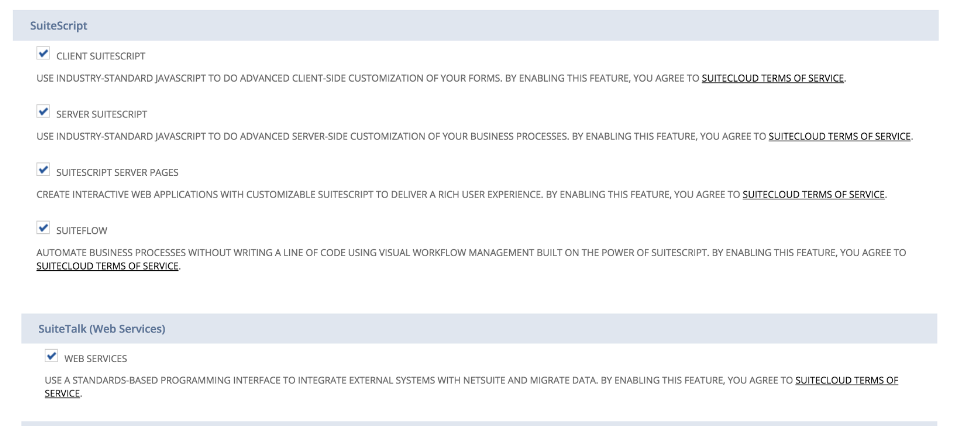
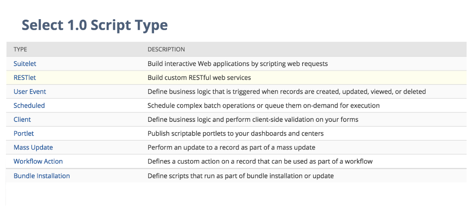
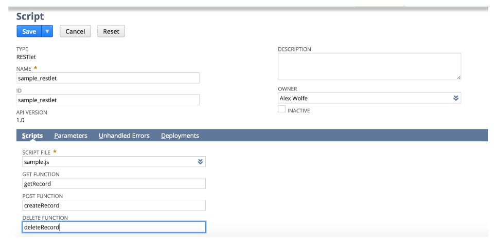
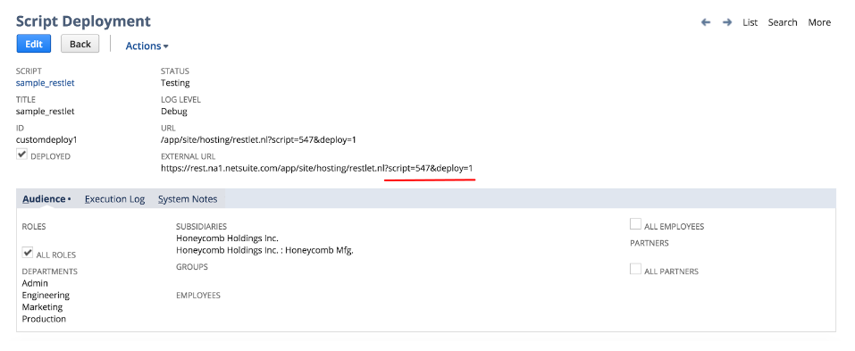
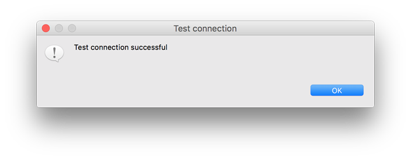
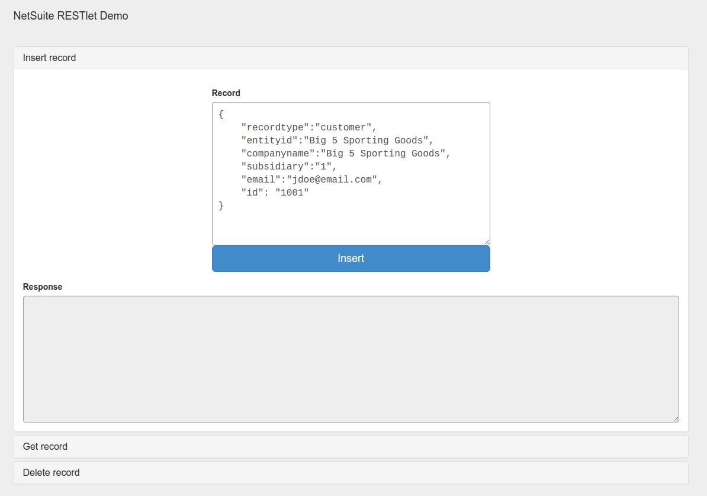
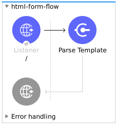
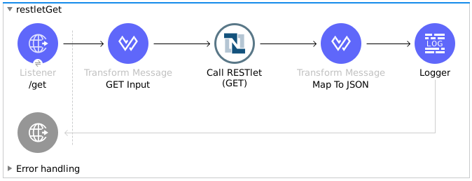
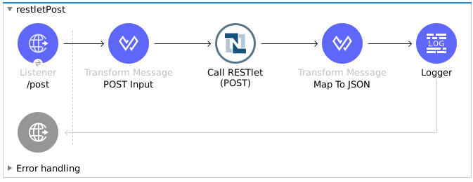
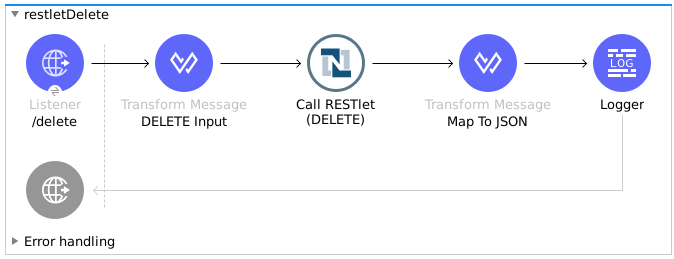

# NetSuite Connector - RESTlet Demo

## Introduction

The aim of this demo is to show the user how to call RESTlets deployed in their NetSuite instances. By following these instructions, you will be able to:
* Create an CUSTOMER record.
* Retrieve the created CUSTOMER record
* Delete it

## Pre-Requisites

* Java 8
* Anypoint Studio 7.x
* Mule Runtime 4.x EE
* DataWeave 2.0
* Access to a NetSuite instance (credentials should be populated into the `mule-app.properties` file)

## Deploy a script as a RESTlet

* Create a sample JavaScript script. You can use the following code, which is provided in the **Introduction to RESTlets** document from April 1st, 2016.

```javascript
// Get a standard NetSuite record
function getRecord(datain)
{
    return nlapiLoadRecord(datain.recordtype, datain.id); // e.g recordtype="customer", id="769"
}

// Create a standard NetSuite record

function createRecord(datain)
{
    var err = new Object();

  // Validate if mandatory record type is set in the request
    if (!datain.recordtype)
    {
        err.status = "failed";
        err.message= "missing recordtype";
        return err;
    }

    var record = nlapiCreateRecord(datain.recordtype);

    for (var fieldname in datain)
    {
      if (datain.hasOwnProperty(fieldname))
      {
        if (fieldname != 'recordtype' && fieldname != 'id')
        {
          var value = datain[fieldname];
            if (value && typeof value != 'object') // ignore other type of parameters
            {
              record.setFieldValue(fieldname, value);
            }
        }
      }
    }
    var recordId = nlapiSubmitRecord(record);
    nlapiLogExecution('DEBUG','id='+recordId);
    var nlobj = nlapiLoadRecord(datain.recordtype,recordId);
    return nlobj;
}

// Delete a standard NetSuite record
function deleteRecord(datain)
{
  nlapiDeleteRecord(datain.recordtype, datain.id); // e.g recordtype="customer", id="769"

}
```

* Enable SuiteScript and Web Services in your account. Login in NetSuite and navigate to Setup -> Company -> Enable Features -> SuiteCloud.



* Create a new Script and upload the file created before. Go to Customization -> Scripting -> Scripts -> New.

* Pick the script file, click on **Create Script Record**, and select **RESTlet**.



* Fill out the form based on the content of the script you uploaded, and deploy the script.



* After selecting your **Audience**, you will see the following page. Take note of the **script** and **deploy** numbers in the **External URL**, since you will need them to call the RESTlet.



## Import the project

* Go to **File > Import**
* Select **Anypoint Studio Project from External Location** (under the parent folder "Anypoint Studio")
* Provide the root path to the demo project folder.
* Select **Mule Runtime (4.x EE)**.
* Click **Finish**.  
* Configure the credentials, as well as the deployed script and deploy IDs, inside the file `src/main/resources/mule-app.properties`.

```
netsuite.email=
netsuite.password=
netsuite.account=
netsuite.roleId=
netsuite.applicationId=
netsuite.subsidiary=
netsuite.script=
netsuite.deploy=
```

* Open the **Global Element Configuration**.

* Click the **Test Connection** button to ensure there is connectivity with the sandbox.

> Test Connection is a **crucial** step. If you are experiencing connectivity issues, you won't be able to execute any part of this or any other demo, nor make use of DataSense.

* A successful message should pop-up.


* Open a browser and access the URL `http://localhost:8081`. You should see the demo application deployed:



## About the flows

**1. html-form-flow:** renders the HTML form with a `parseTemplate` component.



**2. restletGet:** calls the GET function of a RESTlet.



**3. restletPost:** calls the POST function of a RESTlet.



**4. restletDelete:** calls the DELETE function of a RESTlet.



## How To Run the Demo

Run the demo application and hit the following URL in your browser: http://localhost:8081. An accordion-style form will show up which allows to run the different aspects of this demo.
